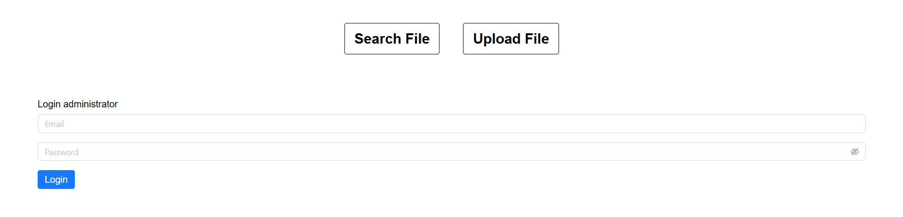
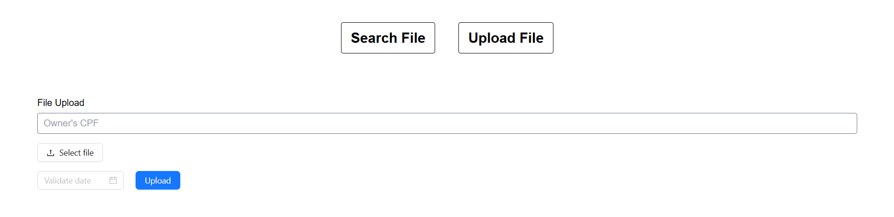
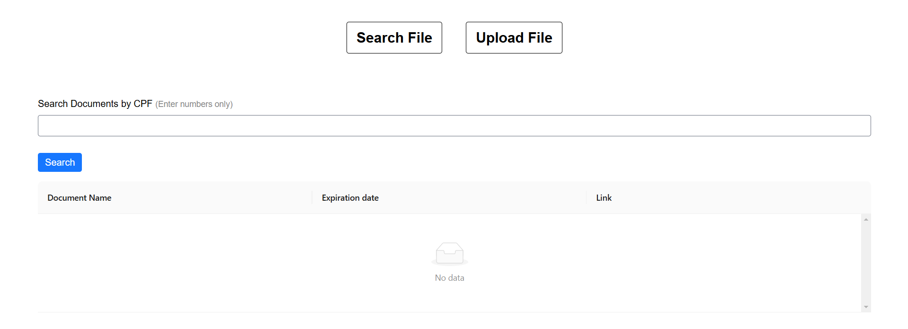

# 📂 Sistema de Gestão de Documentos com Firebase

Este projeto é uma aplicação web que permite a administradores fazerem upload de documentos relacionados a um CPF específico e definir uma data de validade para cada documento. Os usuários podem pesquisar documentos pelo CPF e baixar os arquivos disponíveis.

## 🛠️ Tecnologias Utilizadas

- **React** com **TypeScript**
- **Ant Design** para componentes UI
- **Tailwind CSS** para componentes UI
- **Moment** para manipulação de datas
- **IMaks** para formatação de inputs
- **Firebase** (Autenticação, Firestore, Storage)
- **Vite** para bundling e desenvolvimento

## 🧰 Instalação e Configuração

### Pré-requisitos

- **Node.js** (>= 14.x)
- **npm** ou **yarn**

### Passos para Instalação

1. **Clone o Repositório**

   ```bash
   git clone https://github.com/matheustxr/FireDocs
   cd FireDocs
   
2. **Instale as Dependências**

   ```bash
   npm install 
   # ou 
   yarn install
   
3. **Configuração do Firebase**

    - Crie um projeto no Firebase e habilite os serviços de Autenticação, Firestore e Storage.
    - Crie um arquivo **.env** na raiz do projeto com as seguintes variáveis (substitua pelos valores do seu          projeto Firebase):
    
    ```bash
    .env
    VITE_REACT_APP_FIREBASE_API_KEY=seu-api-key
    VITE_REACT_APP_FIREBASE_AUTH_DOMAIN=seu-auth-domain
    VITE_REACT_APP_FIREBASE_PROJECT_ID=seu-project-id
    VITE_REACT_APP_FIREBASE_STORAGE_BUCKET=seu-storage-bucket
    VITE_REACT_APP_FIREBASE_MESSAGING_SENDER_ID=seu-messaging-sender-id
    VITE_REACT_APP_FIREBASE_APP_ID=seu-app-id


3. **Execute a Aplicação**

    ```bash
    npm run dev
    # ou
    yarn dev

    
## 🚀 Uso da Aplicação
### Página de Administração (`/admin`)

1. **Login de Administrador**
   - Insira o e-mail e a senha do administrador para fazer login. (email: teste@email.com | password: 123456)
   - Após o login bem-sucedido, você será redirecionado para a página de upload de documentos.

   

2. **Upload de Documentos**
   - Insira o CPF do proprietário do documento.
   - Selecione um arquivo PDF clicando no botão "Selecionar Arquivo".
   - Escolha a data de validade do documento usando o seletor de datas.
   - Clique em "Carregar" para enviar o documento para o Firebase Storage e salvar os detalhes no Firestore.

   

### Página Pública (`/`)

1. **Pesquisa de Documentos**
   - Insira um CPF no campo de busca para procurar os documentos associados a esse CPF.
   - Se documentos forem encontrados, eles serão listados com links para download.

   

   - Clique em "Baixar" para abrir ou salvar o documento.

## 🔧 Desenvolvimento e Manutenção

### Adicionando Novo Documento

Para adicionar um novo documento:

1. Faça login na página de administração.
2. Insira o CPF do proprietário do documento.
3. Selecione o arquivo PDF e escolha a data de validade.
4. Clique em "Carregar" para enviar o documento e salvar os detalhes.

### Estrutura do Firestore

Os documentos são armazenados na coleção `documents`, onde cada documento é identificado pelo CPF. Cada documento tem uma subcoleção `files` que contém os arquivos associados.

    Exemplo de estrutura:
        documents/
    ├── {cpf}/
    └── files/
    ├── {fileId}/
    ├── name: "nome_do_arquivo.pdf"
    ├── url: "link_para_o_arquivo"
    └── expirationDate: "data_de_validade"


### Segurança e Boas Práticas

- **Configuração Segura do Firebase**: Assegure-se de configurar as regras de segurança do Firebase Firestore e Storage para proteger os dados sensíveis.
- **Uso de Variáveis de Ambiente**: As credenciais e configurações do Firebase são armazenadas em variáveis de ambiente (`.env`) e não devem ser incluídas no controle de versão.

## 📄 Licença

Este projeto está licenciado sob a Licença MIT. Veja o arquivo [LICENSE](LICENSE) para mais detalhes.

